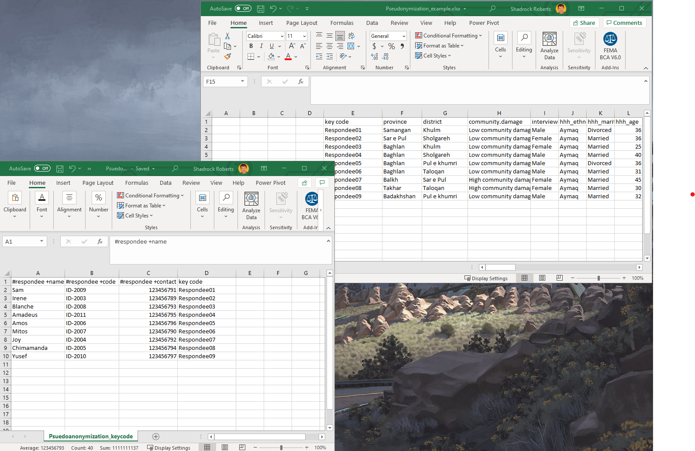

# Pseudonymization
This is an example of one way to de-identify data in a spreadsheet. There are a wide variety of ways to perform deidentification and this example uses a "key code" to remove personally identifiable information (PII) found in direct identifiers and keep it in a separate file.

We've created a sample data set for this exercise, which [you can find it in the data folder here](data/Pseudonymization_example.csv). These data were originally created for the Humanitarian Data Centre's [online tutorial for conducting a disclosure risk assessment](https://centre.humdata.org/learning-path/disclosure-risk-assessment-overview/). We have added fields containing PII for this exercise.

## Step 1 - Identify PII
Start by identifying PII in the data. Ideally, you will have metadata - data or a document that defines your data - to help you understand which fields contain PII. In the sample data, there are three columns that contain potential PII:
- `#respondee +name` appears to contain a name.
- `#respondee +code` likely contains an identification number of some kind.
- `#respondee +contact` possibly contains a mobile phone number

Each of these direct identifiers uses the [Humanitarian Exchange Language for tagging data](https://hxlstandard.org).

## Step 2 - Create New Columns for the Key Code
We will use a key code, a value that we generate, to break out the PII. Since the the direct identifiers are all grouped together, we'll create two new columns between columns C, `#respondee +contact` and column D, `province`. In Excel, we do this by highlighting a column to the right of where we want to insert new columns, right-click on the column and select `Insert`. Repeat this process again to create another empty column.

## Step 3 - Create the Key Code
Start by naming your new columns. We'll use "key code" in each of them: each column will hold the same values. This would be a good time to update any metadata about this dataset to explain what `key code` means! Next, we'll use [Excel's Auto Fill feature](https://support.microsoft.com/en-us/office/fill-data-automatically-in-worksheet-cells-74e31bdd-d993-45da-aa82-35a236c5b5db) to create a simple code. Type `Respondee01` in the first cell. Next, highlight that cell, click on the drag handle in the lower right corner of the cell, and drag down to the end of the data set. This will automatically fill in the final number of each record so that each respondee now has a new code.

## Step 4 - Duplicate the Key Code and Remove Formulas
Now we will copy the key code and paste it into the adjacent column. You can do this using basic keyboard commands such as `ctrl + C` or highlight the cells you want to copy, right click on them, and select `Copy`. In the adjacent column highlight the cells you want to paste the new key code into, right-click, and choose `Paste`. I've chosen to specifically paste only values. If you have used a formula to create a new code, then it will be important to retain *only the values* for use as a key code!

## Step 5 - Separate Direct and Indirect Identifiers
Highlight the columns that contain the direct identifiers with PII along with one of the key code columns. In this example, we are highlighting columns A-D. Right-click on them and select `Cut`.

Next, open a new spreadsheet and paste these values using the keyboard shortcut `ctrl + V`, or other method. Save the new spreadsheet. You now have two spreadsheets: one of them contains indirect identifiers while the new sheet contains the direct identifiers with PII. Both datasets contain a key code for each record in the data so that all data can be recombined when necessary.

## Next Steps
Both files contain a key code that will allow them to be put back together. One way to do this in Excel, is to use the [`VLOOKUP` function](https://support.microsoft.com/en-us/office/vlookup-function-0bbc8083-26fe-4963-8ab8-93a18ad188a1) to automatically populate cells based on the value of other cells. In this case, you could populate empty cells in the original file with the missing PII based on the `keycode` value.

Because the new file contains the direct identifiers containing PII, it must be stored securely. One excellent way to do this is to encrypt the file and to use cloud storage to limit who has access to the file (see the Encryption and File-sharing sections of the guide).

**Remember: while the original spreadsheet has been deidentified by removing the direct identifiers that contain obvious PII, the other indirect identifiers have the potential to be combined with other data or analyzed in such a way as to allow for an individual to be identified.** For this reason, both files should still be stored securely. If you wanted to share the original, non-PII, file more widely it would be critical to perform a *disclosure risk assessment* to ensure the minimum amount of risk that the data could be re-identified. The Humanitarian Data Centre has an [online tutorial for conducting a disclosure risk assessment](https://centre.humdata.org/learning-path/disclosure-risk-assessment-overview/) using the [open source statistical software "R"](https://www.r-project.org/). Additionally, [Poverty Action Lab's *De-identification for data publication*](https://www.povertyactionlab.org/resource/data-de-identification) web page provides an excellent discussion of data deidentification and includes sample code for the [statistical software Stata](https://www.stata.com/). For Mercy Corps staff, [Draft Guidance from T4D](https://docs.google.com/document/d/1wFI5Ltvu9abtuRDVVZnbY2rdR61N3Eel4egZ02HuvU0/edit?usp=sharing) is available internally and provides additional Excel formulas.  

Finally, all of these steps together help mitigate risk or exposing PII, so they should be listed in the PIA (see the Privacy Impact Assessment section of the guide) so that others understand how these data are being protected.
