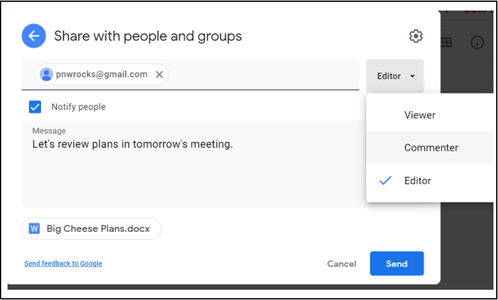
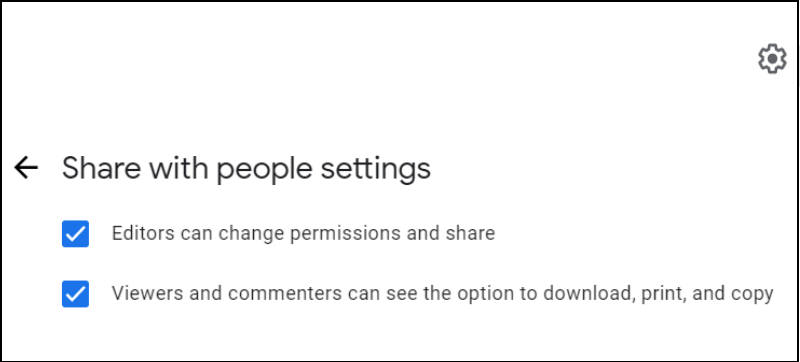

# File Sharing: GDrive

As needed per section.

As needed per section.

As needed per section.

As needed per section.

As needed per section.

As needed per section.

As needed per section.

As needed per section.

## Further Assistance
This document will not cover file sharing in Google’s shared drives, nor external file sharing platforms. To learn more about these, visit Google’s [Best practices for shared drives](https://support.google.com/a/users/answer/9310352?hl=en) or [managing shared drives page](https://support.google.com/a/topic/7337266?hl=en&ref_topic=2490075). Each of these pages is available in a variety of languages: scroll to the bottom of the page to select your language.

The best way to control access to files using Drive is to create a Google group and assign permissions to those in the group. Google groups are not just for sending emails; groups are powerful and convenient tools for managing folder and file permissions. [Find out more about Google Groups here](https://support.google.com/groups/?hl=en#topic=9216).

If your project requires the use of applications outside of G Suite, encourage your team to download [Google Drive for desktop](https://support.google.com/drive/answer/7329379?hl=en). This program allows you to view any documents in My Drive or Shared drives as if they were on your laptop, even when offline, and without having to download the item or convert it to a Google format.
