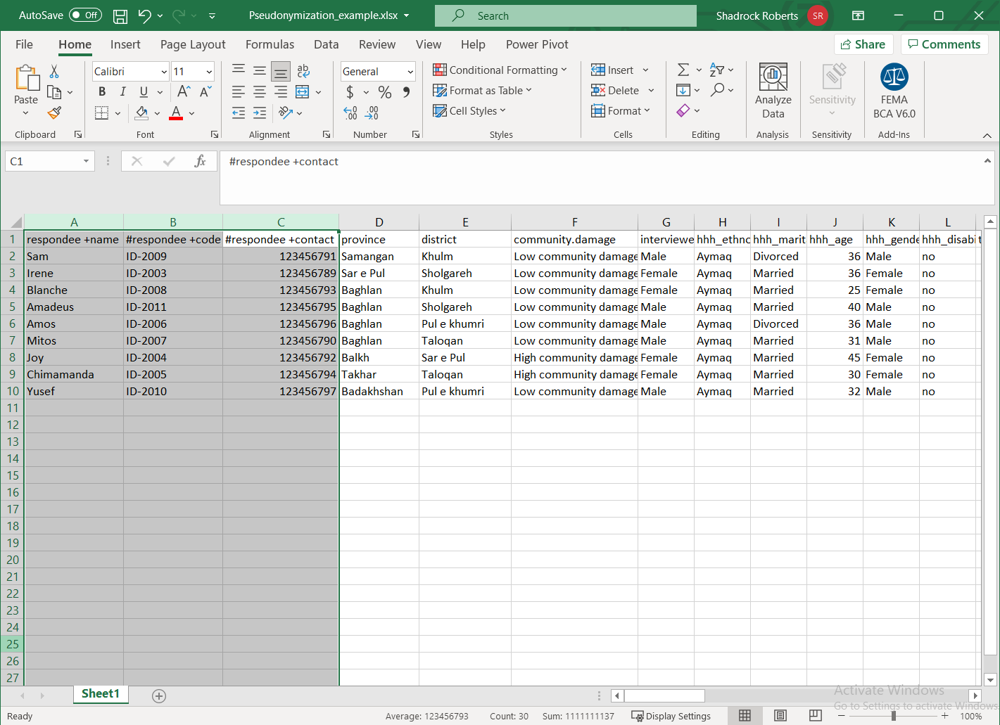
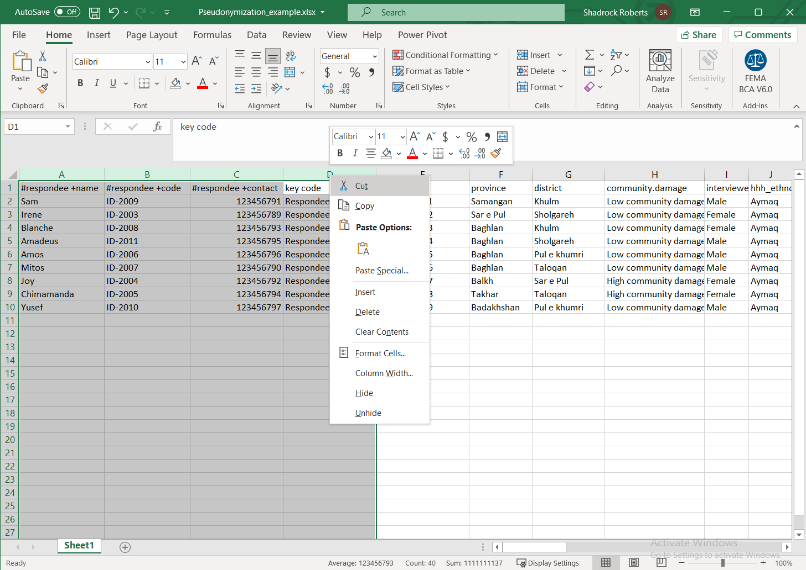

# Псевдонімізація
Це приклад одного зі способів знеособлення даних в електронній таблиці. Існує широкий спектр способів знеособлення. У цьому прикладі використовується «ключовий код» для видалення інформації, що ідентифікує особу, знайденої в прямих ідентифікаторах, і збереження її в окремому файлі. Інформація, що ідентифікує особу, (ІІО) — це інформація, яка може бути використана для визначення особи. Типовими прикладами є повне ім'я, адреса, номер телефону, дата народження та номер соціального забезпечення або національний ідентифікаційний код.

У цій вправі використовується [зразок набору даних, знайдений у папці з даними онлайн-посібника](data/Pseudonymization_example.csv). Після псевдонімізації зразка даних ви можете продовжити роботу з навчальним посібником від Центру гуманітарних даних [для проведення оцінки ризиків розкриття даних](https://centre.humdata.org/learning-path/disclosure-risk-assessment-overview/).

## Крок 1 — визначте ІІО
Почніть із виявлення ІІО в даних. В ідеалі у вас будуть метадані — дані або документ, який визначає ваші дані, — щоби допомогти вам зрозуміти, які поля містять ІІО. У зразку даних є три стовпці, які містять потенційну ІІО:
- № респондента +ім'я (`#respondee +name`), схоже, містить ім'я.
- № респондента +код (`#respondee +code`), ймовірно, містить якийсь ідентифікаційний номер.
- № респондента +контакт (`#respondee +contact`), можливо, містить номер мобільного телефону.

Кожен із цих прямих ідентифікаторів використовує [гуманітарну мову обміну для позначення даних](https://hxlstandard.org).

## Крок 2 — створіть нові стовпці для ключового коду
Ми будемо використовувати ключовий код, значення, яке ми генеруємо, щоби розбити ІІО. Оскільки всі прямі
ідентифікатори згруповані разом, ми створимо два нових стовпці між стовпцем C, № респондента +контакт (`#respondee +contact`) і стовпцем D, область (`province`). У Excel ми робимо це, виділяючи стовпець праворуч від того місця, куди ми хочемо вставити нові стовпці. Клацніть правою кнопкою миші на стовпці та оберіть "Вставити". Повторіть цей процес ще раз, щоби створити ще один пустий стовпець.

## Крок 3 — створіть ключовий код
Почніть з іменування нових стовпців. Ми будемо використовувати "ключовий код" у кожному з них: кожен стовпець буде містити однакові значення. Зараз саме час оновити всі метадані цього набору даних, щоби пояснити, що означає ключовий код ! Далі ми скористаємося [функцією Excel "Автозаповнення"](https://support.microsoft.com/en-us/office/fill-data-automatically-in-worksheet-cells-74e31bdd-d993-45da-aa82-35a236c5b5db) для створення простого коду. Введіть Респондент01 у першу комірку. Далі виділіть цю комірку, натисніть на маркер перетягування в правому нижньому кутку комірки та перетягніть його вниз до кінця набору даних. Це автоматично заповнить остаточний номер кожного запису, щоб кожен респондент тепер мав новий код.

## Крок 4 — дублювання ключового коду та видалення формул
Тепер скопіюємо ключовий код і вставимо його в сусідній стовпець. Зробити це можна за допомогою основних клавіатурних команд, зокрема ctrl + C, або виділіть комірки, які потрібно скопіювати, клацніть на них правою кнопкою миші та оберіть "Копіювати". У сусідньому стовпці виділіть комірки, в які потрібно вставити новий ключовий код, клацніть правою кнопкою миші та оберіть "Вставити". Ми вирішили спеціально вставити лише значення. Якщо для створення нового коду ви використовували формулу, то важливо буде зберегти лише значення для використання як коду ключа!

## Крок 5 — відокремте прямі та непрямі ідентифікатори
Виділіть стовпці, які містять прямі ідентифікатори з ІІО, а також один із стовпців із ключовим кодом. У цьому прикладі ми виділяємо стовпці A-D. Клацніть на них правою кнопкою миші та оберіть "Вирізати".

Далі відкрийте нову електронну таблицю та вставте ці значення за допомогою комбінації клавіш ctrl + V або іншим способом. Збережіть нову електронну таблицю. Тепер у вас є дві електронні таблиці: одна з них містить непрямі ідентифікатори, тоді як новий аркуш містить прямі ідентифікатори з ІІО. Обидва набори даних містять ключовий код для кожного запису в даних, щоб усі дані можна було об'єднати, коли це необхідно.

## Наступні кроки
Обидва файли містять ключовий код, який дозволить знову об'єднати їх. Одним зі способів зробити це в Excel є використання [функції VLOOKUP](https://support.microsoft.com/en-us/office/vlookup-function-0bbc8083-26fe-4963-8ab8-93a18ad188a1) для автоматичного заповнення комірок на основі значення інших комірок. У цьому випадку можна заповнити пусті комірки у вихідному файлі відсутньою ІІО на основі значення ключового коду.

Оскільки новий файл містить прямі ідентифікатори з ІІО, його потрібно надійно зберігати. Один чудовий спосіб зробити це — зашифрувати файл і використовувати хмарне сховище, щоб обмежити кількість тих, хто має доступ до файлу (дивіться посібники з найкращих практик шифрування та обміну файлами).   

**Пам'ятайте: хоча оригінальна електронна таблиця була знеособлена шляхом видалення прямих ідентифікаторів, які містять очевидну ІІО, інші непрямі ідентифікатори можуть бути об'єднані з іншими даними або проаналізовані таким чином, що це дозволить ідентифікувати особу.**

З цієї причини обидва файли слід надійно зберігати. Якщо ви хочете надати ширший доступ до оригінального файлу, без ІІО, вкрай важливо виконати оцінку ризиків розкриття даних, щоби забезпечити мінімальний ризик повторної ідентифікації даних. Центр гуманітарних даних має [навчальний онлайн-посібник для проведення оцінки ризиків розкриття даних](https://centre.humdata.org/learning-path/disclosure-risk-assessment-overview/) із використанням [статистичного програмного забезпечення "R" із відкритим вихідним кодом](https://www.r-project.org/). Крім того, веб-сторінка [Poverty Action Lab "Знеособлення для публікації даних"](https://www.povertyactionlab.org/resource/data-de-identification) містить чудове обговорення знеособлення даних і зразок коду для [статистичного програмного забезпечення Stata](https://www.stata.com/). Співробітники Mercy Corps мають внутрішній доступ до [Проєкта настанов від T4D](https://docs.google.com/document/d/1wFI5Ltvu9abtuRDVVZnbY2rdR61N3Eel4egZ02HuvU0/edit?usp=sharing), де є додаткові формули Excel.  

Нарешті, всі ці кроки разом допомагають зменшити ризик розкриття ІІО, тому вони повинні бути перераховані в ОВК (дивіться посібник з оцінки впливу на конфіденційність), щоб інші розуміли, яким чином ці дані захищені.
