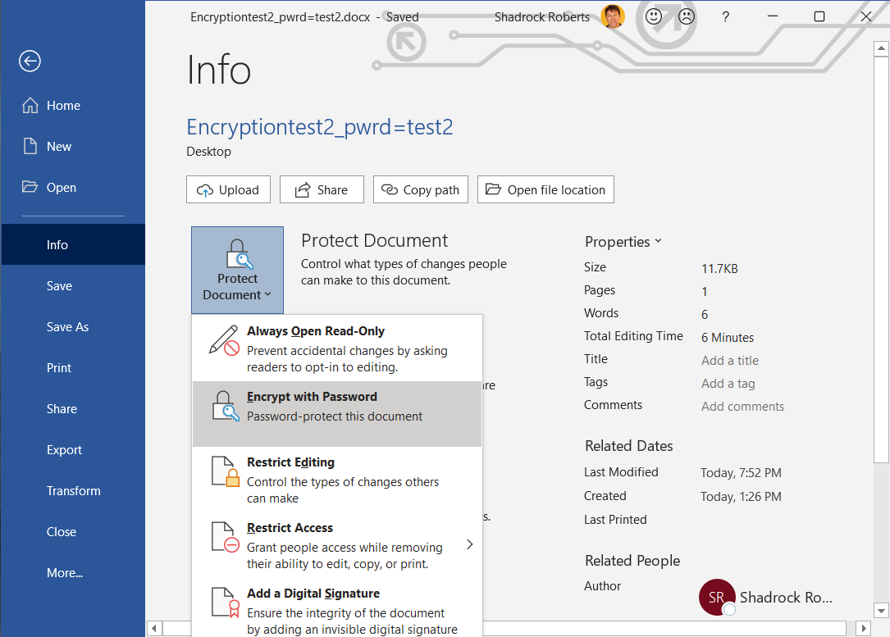

**альтернативні формати**: [Дивіться відео для цього посібника тут](https://youtu.be/0o_jdQiTkvo). [Отримати доступ до цього довідника як до файла PDF](https://dldocs.mercycorps.org/DPPEncryptionGuideUA.pdf).

# Шифрування файлу
У цьому розділі розглядається простий приклад шифрування файлу за допомогою функції Microsoft, доступної на комп'ютерах Mercy Corps. Є цілий ряд факторів, які слід враховувати при шифруванні файлу, але тут ми зосередимося на використанні пароля та шифруванні одного файлу. Дивіться нижче посилання на ресурси, які досліджують шифрування глибше. Щодо цього посібника, однак, корисно зрозуміти тонку різницю між "захистом паролем" та "шифруванням".

Уявіть захист паролем як коробку з замком на ній. Коли ви "захищаєте паролем" свій документ, ви кладете його в електронну коробку і закриваєте паролем — відкрити коробку можуть лише ті, хто має пароль. Однак, якщо обраний вами пароль не дуже надійний, або якщо ви поділилися ним не з тією людиною, хтось може легко потрапити в цю коробку і переглянути ваш документ! На відміну від цього, шифрування використовує складні алгоритми для кодування інформації, що вимагає наявності ключа для розшифровки цієї інформації. Уявіть це, ніби ви взяли документ і пропустили його через шредер, на якому є спеціальна кнопка, щоби знову зібрати документ в одне ціле.

Коли ви поєднуєте захист паролем і шифрування, то ефективно подвоюєте свій захист. Якщо хтось успішно зламає пароль до електронної коробки, він зможе побачити лише шматочки подрібненого паперу, якщо не має відповідного ключа. Усі ноутбуки Mercy Corps зашифровано за допомогою Microsoft BitLocker. Це запобігає тому, щоби жорсткий диск ноутбука Mercy Corps можна було вийняти та отримати до нього доступ на іншому комп'ютері.

## Важливість
Шифрування дуже важливе, оскільки воно допомагає забезпечити конфіденційність та безпеку інформації. Без шифрування дані можуть бути перехоплені та прочитані будь-якою людиною, яка має до них доступ. При розгляді питання про те, чи потрібно шифрувати дані, запитайте себе: "Який існує ризик для учасників програм, співробітників і партнерів Mercy Corps у разі втрати або крадіжки цих даних?" Хороше практичне правило — шифрувати все, що містить інформацію, що ідентифікує особу, або чутливу інформацію.

## Принципи
- Використовуйте затверджені системи Mercy Corps для зашифрованої передачі та зберігання даних (наприклад, Microsoft SharePoint або Google Диск). Якщо сумніваєтеся, зверніться за порадою до місцевої ІТ-команди.
- Шифруйте чутливі дані на всіх етапах їх збору, використання, передачі та зберігання.
- Використовуйте надійні паролі та не використовуйте паролі повторно. Списки паролів циркулюють в інтернеті та полегшують доступ до кількох ваших облікових записів або файлів тому, хто має один з ваших паролів! Можливо, ви захочете скористатися менеджером паролів, наприклад Lastpass. Однак менеджери паролів можуть бути вразливими до кібератак фальшивих додатків, тому вкрай важливо, щоби менеджери паролів використовувалися як частина ширшого підходу до захисту даних.
- У командному середовищі шифрування настільки надійне, наскільки надійна його найслабша ланка. Якщо навіть одна людина не використовує шифрування, дані вашої програми перебувають під загрозою. Надзвичайно важливо донести своїй команді: шифрування — це питання не лише технологій, але й зміни поведінки.
- Розберіться із законами, які регулюють шифрування у вашій країні. Місцеві закони в ряді країн (зокрема Судані, Ємені та Пакистані) накладають обмеження на програмне забезпечення для шифрування. Якщо сумніваєтеся, зверніться до місцевої ІТ-команди за порадою: як правило, вони співпрацюватимуть із вами, щоби забезпечити належне шифрування жорстких дисків ваших комп'ютерів за допомогою Intune.

## Інструкції

1. Відкрийте файл Word, Excel або PowerPoint, який потрібно зашифрувати, і виберіть меню "Файл".

2. Перейдіть до "Інформація" > "Захистити документ" > "Шифрування паролем".

3. Введіть пароль, натисніть OK, а потім введіть його ще раз, щоби підтвердити.

4. Збережіть файл, щоби переконатися, що пароль діє.

Тепер ви можете поділитися файлом і паролем з тими, хто потребує доступу. Найкраще розміщувати файл на хмарному сервісі, затвердженому Mercy Corps, зокрема G Suite або SharePoint. Не забудьте надіслати посилання на файл і посилання на пароль окремо. Наприклад, ви можете поділитися файлом за допомогою Google Диска (див. розділ "Спільне використання файлів") і створити повідомлення про те, що файл був переданий через Google, а потім переслати пароль на електронну пошту колеги.

## Додаткова підтримка
- ["Довідник про дані для початківців"](https://www.calpnetwork.org/wp-content/uploads/2020/06/DataStarterKitforFieldStaffELAN.pdf) від Electronic Cash Transfer Learning Action Network містить низку порад щодо шифрування (див. листок порад №5).
- Electronic Frontier Foundation більш [детально розглядає різні форми шифрування](https://ssd.eff.org/en/module/what-should-i-know-about-encryption).
- ["Довідник спеціаліста із сучасного розвитку"](https://the-engine-room.github.io/responsible-data-handbook/) від Engine Room містить розділ про керування даними, в якому наводяться додаткові думки високого рівня про шифрування.
